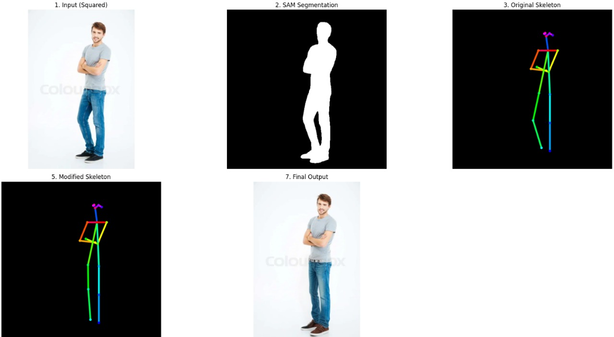
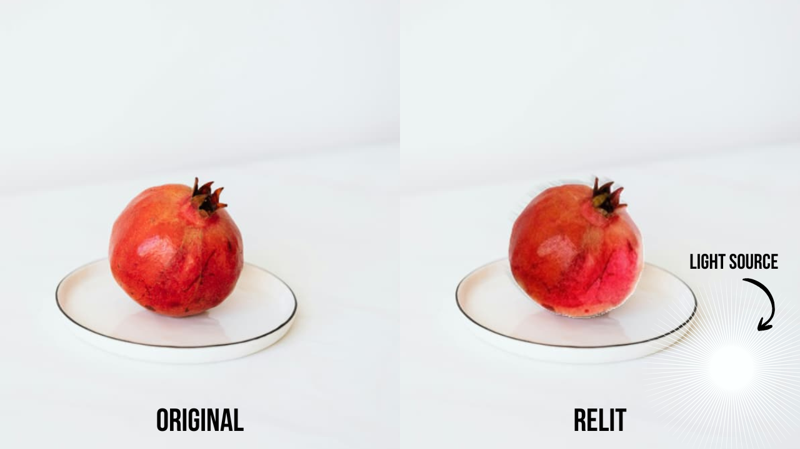

<div align="center">
  

  **Editing app for the future**

  [](https://flutter.dev)
  [](https://www.python.org)
  [](https://opensource.org/licenses/MIT)
</div>

A comprehensive image editing and manipulation application featuring AI-powered tools for pose correction, relighting, inpainting. The project combines a Flutter frontend with a Python gRPC backend for advanced image processing capabilities.

## Description

Aurora Image Editing Suite is a full-stack application designed to provide professional image editing capabilities with AI-powered models. The application features:

- **Pose Correction & Reframe**: Adjust and modify human poses and object position in images using masks and pose landmarks
- **Relighting**: Dynamically relight images with customizable light configurations
- **Smart Editing Tools**: Context-aware inpainting and background manipulation

The application features a high-performance **Flutter** frontend optimized for modern Android devices. Its robust **Python** backend utilizes **gRPC** for efficient, low-latency communication.

## Demo Video
<div align="center">
  <video src="assets/demo.mp4" width="100%" controls></video>
</div>

## File Structure

```
aurora/
├── README.md                 # Project documentation
├── SETUP.md                  # Setup instructions
├── THIRD_PARTY_LICENSES      # Third party license information
├── init.sh                   # Initialization script
├── .python-version          # Python version specification
├── .gitmodules              # Git submodules configuration
├── Submissions/             # Submissions directory
├── protos/                  # Protocol Buffer definitions
│   ├── pose.proto          # Pose service definitions
│   └── relighting.proto    # Relighting service definitions
├── backend/                # Python backend server
│   ├── __init__.py
│   ├── main.py            # Entry point for gRPC server
│   ├── service.py         # gRPC service implementations
│   ├── requirements.txt    # Python dependencies
│   ├── pose_pb2.py        # Generated pose protobuf
│   ├── pose_pb2_grpc.py   # Generated pose gRPC
│   ├── relighting_pb2.py  # Generated relighting protobuf
│   ├── relighting_pb2_grpc.py  # Generated relighting gRPC
│   ├── ml_models/         # ML model implementations
│   │   ├── __init__.py
│   │   ├── pose_change.py # Pose correction pipeline
│   │   ├── relighting.py  # Relighting pipeline
│   │   ├── mobile_sam.pt  # Mobile SAM model weights
│   │   └── relighting/    # Relighting model resources
│   │       ├── config.py
│   │       ├── config.yaml
│   │       ├── requirements.txt
│   │       ├── create_env_map_metadata.py
│   │       ├── run_relight.py
│   │       ├── upscaler.py
│   │       ├── downloads.sh
│   │       ├── env_map/   # Environment maps for relighting
│   │       ├── realesrgan/ # Real-ESRGAN upscaler
│   │       └── src/       # Source code for relighting pipeline
│   └── model/             # Data models
│       ├── __init__.py
│       └── lights_model.py # Light configuration models
├── frontend/              # Flutter mobile/desktop application
│   ├── pubspec.yaml      # Flutter dependencies
│   ├── lib/              # Flutter source code
│   │   ├── main.dart     # Application entry point
│   │   ├── models/       # Data models (edit history, pose landmarks)
│   │   ├── screens/      # UI screens
│   │   ├── services/     # API and service layer
│   │   ├── theme/        # Theming and styles
│   │   ├── widgets/      # Reusable UI components
│   │   └── generated/    # Generated protobuf Dart files
│   ├── assets/           # Application assets
│   │   ├── models/       # ML model files (TFLITE, ONNX)
│   │   ├── demo/         # Demo images
│   │   ├── icons/        # App icons
│   │   └── suggestions.json
│   ├── android/          # Android-specific configuration
│   ├── ios/              # iOS-specific configuration
│   ├── windows/          # Windows-specific configuration
│   ├── macos/            # macOS-specific configuration
│   ├── linux/            # Linux-specific configuration
│   └── test/             # Flutter tests
├── assets/               # Project assets (images, diagrams)
│   ├── header.png
│   ├── backend-processing-diagram.png
│   ├── Posecorrection.jpg
│   └── Relighting.png
└── protos/               # Protocol buffer definitions
```

### 🛠️ Tech Stack

#### Backend (Python 3.9+)
- **Communication**: gRPC with Protocol Buffers
- **Core**: `grpcio`, `protobuf`, `pydantic`, `numpy`, `Pillow`, `opencv-python-headless`
- **ML Frameworks**: `torch`, `torchvision`, `transformers`, `diffusers`, `peft`

#### Frontend (Flutter 3.9.2+)
- **Framework**: Flutter 3.9.2+
- **Image Processing**: `image_picker`, `image`, `crop_image`
- **ML on Device**: `tflite_flutter`, `onnxruntime_v2`
- **Communication**: `grpc`, `flutter_dotenv`
- **UI/UX**: `google_fonts`, `flutter_svg`, `liquid_glass_renderer`, `share_plus`, `path_provider`, `cupertino_icons`

## Local Testing
Refer to `SETUP.md` [here](./SETUP.md).

## User Workflow

<!-- TODO: Add GIFS here later -->

### Mobile/Desktop Application Flow

**1. Launch Application**
   - Open the Aurora image editing application
   - Application loads available editing tools

**2. Image Selection**
   - Select an image from gallery or camera
   - Image is displayed in the editor canvas

**3. Select Editing Tool**
   - Choose from available tools:
     - **Pose Correction and Reframe**
     - **Relighting**
     - **Context-aware Auto Suggestion**

**4. Configure Tool Parameters**
   <details>
   <summary><b>Pose & Reframe Tool</b></summary>
   
   - Choose the object/subject to be edited
   - Adjust pose landmarks (joints) by dragging points
   - Confirm and apply changes
   </details>

   <details>
   <summary><b>Relighting Tool</b></summary>

   - Choose the object to be relit
   - Select light positions and intensity
   - Adjust color temperature
   - Confirm and apply changes
   </details>

**5. Processing**
   - Frontend sends request to backend via gRPC
   - Backend processes image using appropriate ML model
   - Processed image is returned to frontend
   - Result displayed 

**6. Edit History**
   - Maintain edit history for undo/redo
   - User can revert to previous versions

**7. Export**
   - Save edited image to device storage
   - Share to social media or messaging apps

### Backend Processing Pipeline

1. **Request Reception** (gRPC Service)
   - Service receives image data and parameters
   - Validates input data

2. **Image Preprocessing**
   - Decode image from bytes
   - Load mask data
   - Prepare data for ML models

3. **Model Processing**
   - Run appropriate ML pipeline
   - Apply transformations
   - Generate processed image

4. **Postprocessing**
   - Encode result to PNG/JPEG
   - Prepare response
   - Send back to frontend

5. **Error Handling**
   - Error handling with user-friendly messages
   - Logging for debugging

## Models Used

### On-Device Models (Frontend)
- **Pose Landmark**: Human pose detection (`pose_landmark_full.tflite`)
- **Magic Touch**: Interactive segmentation (`magic_touch.tflite`)
- **Qwen GGUF**
- **SigLIP Tags**: Image tagging and classification

### Server-Side Models (Backend)
- **LAMA**: Inpainting model
- **Zero-1-to-3**: Object regeneration model
- **Depth-Anything V2**: Depth estimation
- **MediaPipe Holistic**: Pose landmark detection
- **SAM**: For server side segementation.
- **Stable Diffusion**: Conditioned on ControlNet.
- **Real-ESRGAN**: Upsampling

<!-- This is the start of Pipelines Architecture -->

## Pipelines Architecture

### Pose Correction and Reframe Pipeline


The pose correction pipeline enables users to adjust and modify human poses in images through landmark manipulation.

**Pipeline Components**:

1.**Pose Detection**: MediaPipe Holistic analyzes the image to accurately map the original keypoints for all body parts.

2. **Segmentation**: SAM isolates the human figure to define the exact boundaries for texture extraction and inpainting.

3. **Keypoint Modification & Hip Scaling:** User-defined offsets adjust the target keypoints (Arms: Elbow/Wrist; Legs: Knee/Ankle), and hip offsets calculate the HIP_SCALE for slimming/widening.

4. **Extract & Warp (Arms/Legs)**: Targeted limb segments (e.g., Hip → Knee) are extracted using the SAM mask, geometrically warped/rotated to match the new pose, and pasted into the canvas.

5. **Inpainting via SD & ControlNet**: The original limb area is erased/filled, and the final mask (covering erased and warped areas) guides the ControlNet-conditioned Stable Diffusion model (using the Lykon/dreamshaper-8-inpainting checkpoint) to seamlessly regenerate the image according to the new skeleton.

**Input Parameters**:
- Original image (RGB format)
- Modified configuration (JSON with landmark adjustments)
- Object selection coordinates
- Transform parameters for translation
- Mask for subject processing
   
**Output**:
- Pose-corrected, reframed image maintaining visual coherence

**Performance Considerations**:
- Real-time landmark detection (< 200ms on CPU)
- Warping complexity scales with image resolution
- Recommended resolution: 1024×1024 for optimal quality/speed trade-off
- Typical runtime: 6-8 seconds
- Memory: 2–3 GB VRAM

### Relighting Pipeline



The relighting pipeline dynamically adjusts lighting conditions in images with customizable light configurations.

**Pipeline Components**:

1. **Object segmentation**: Segments the object from the image based on user input
2. **Light Configuration**: Accepts user-defined light positions, and intensity
3. **Environment Map Generation**: Creates environment maps based on config
4. **Neural Relighting**: Model applies learned relighting transformations

**Input Parameters**:
- Original image
- Light configuration (JSON with light properties)
- Mask for object

**Output**:
- Relit image with adjusted lighting conditions

**Performance Considerations**:
- Model inference: under 10 seconds for 1024x1024 images
- GPU acceleration recommended for production use
- Memory requirement: Under 8GB VRAM

## Compute Profile and Resource Requirements

### Development Environment
#### Data for A5000

| Model | Precision | Device | Inference Time | Peak Memory Range | ||
|-------|-----------|--------|-----------------|-------------------|----------------------|--------------|
| NeuralGaffer | FP16 (on GPU) | CUDA/CPU | 3-4s | 4-4.5 GB | ||
| Reframing | FP32/INT8 | CPU/GPU | Time (ms/s) | Range (MB/GB) | ||
| Stable Diffusion + ControlNet | FP16 (on GPU) | CUDA/CPU | 3-4s | 4.5 - 5 GB |  | |

<!-- ### Production Deployment

#### Server Configuration
- **CPU Cores**: 8-16 cores (for thread pool processing)
- **RAM**: 32 GB (Recommended for concurrent requests)
- **GPU**: NVIDIA A5000 or equivalent for high throughput -->

## Models
**On-Device Models** (Frontend - Real-time):
- Magic Touch, Pose Landmark (TFLITE format)
- Advantages: Low latency (50-200ms), privacy, offline capability
- Trade-offs: Limited model complexity, device power consumption

**Server-Side Models** (Backend - High-quality):
- LAMA (inpainting), Zero-1-to-3(Relighting)
- Advantages: High-quality results, complex operations, scalability
- Trade-offs: Network latency, server load, scalability challenges

## Runtime Decisions and Optimizations


### Optimization Techniques

#### 1. Model Quantization
- **INT8 Quantization**: Reduction in model size with minimal quality loss

### Memory Management
**Model Loading - One time**

Relighting: ~2.5 GB
Pose correction: ~1 GB

**Per-Request Management**

Input image: 50-200 MB
Working memory: 500 MB - 2 GB


### Latency Optimization

#### Expected Response Times (Local Network)

| Operation | On-Device (s) | Server (s) | Total (s) |
|-----------|----------------|------------|-----------|
| Pose Detection | 0.8-1 | 6-7 | 7-8 |
| Relighting | 0.5-1 | 6-7 | 6.5-8 |
| Reframing | 3-5 | - | 3-5 |


## Ethics & Transparency
#### Responsible AI Editing for 2030

Aurora is designed as a future-ready, ethical AI editor. Our goal is to provide powerful creative tools while ensuring user consent, transparency, and responsible model usage.

### AI Edit Disclosure
An AI-Edit Disclosure Panel communicates which parts of the image were changed and which models powered the edit.    
- **In-App Provenance Badge**: A small badge is shown on exported images    
- **C2PA-style Disclosure Panel**: Makes AI involvement clear, showing features applied, models used, sources    
- **Invisible provenance watermark**: Encoded in image using LSB embedding.    

### Edit Traceability & Modified-Region Detection
Aurora supports region-level transparency by computing an Edit Heat Map showing exactly which parts of the image were altered and including this in the metadata.

### Consent & Privacy Controls

Aurora includes an explicit, user-facing consent step before allowing any cloud-based AI processing.   
- **Cloud Processing Consent Prompt in UI**: We disclose that we mayhave to process user images on cloud, but these are not stored or used in training   
- **On-Device by Default**: Whenever possible, the app uses offline editing   

### Misuse Prevention & Ethical Guardrails

To prevent harmful or deceptive editing:

No face-reshaping, identity manipulation, or deepfake creation   
Pose correction limited to mild geometric adjustments    
Sensitive images (IDs, minors, official documents) trigger warnings    

These constraints ensure ethical safety while retaining creative freedom.

### Open-Source Model Licensing Transparency

Every model used in the pipeline is open-source, auditable, and ethically licensed.
We avoid proprietary, opaque, or illegally sourced datasets.

Model Licensing Summary

- LaMa (Dilated) — MIT License. Fully open and unrestricted with attribution.

- MagicTouch.tflite — Derived from Google/Meta segmentation research (Apache 2.0).

- MediaPipe Holistic — Apache 2.0, includes explicit anti-misuse guidelines.

- Stable Diffusion 1.5 — OpenRAIL-M license restricting harmful/deceptive use.
